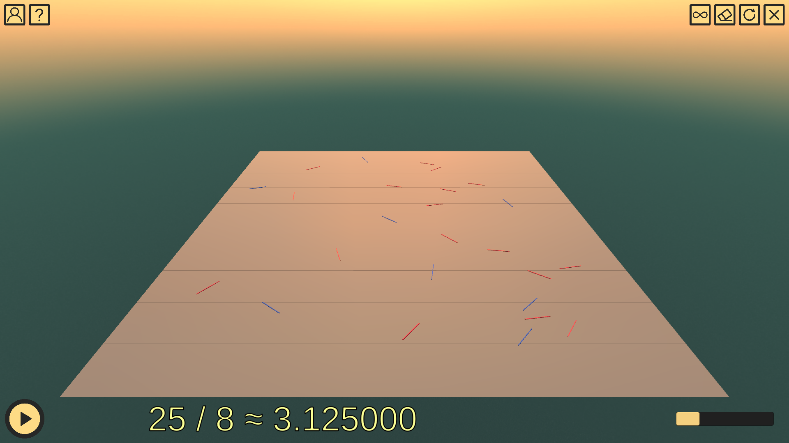

# Piying

This is the official github page of **Piying**, a simple [Unity](https://unity.com/) app developed for 2023 π-day showcasing the so called [Buffon's needle problem](https://en.wikipedia.org/wiki/Buffon%27s_needle_problem), where π constant emerges from deceptively simple conditions. Please note that the app interface is available **only in Ukrainian**.



🛠 Key Features
- 🌐 Feature 1: Observe randomly positioned needles fall and change color depending on whether they cross the grid (see [Buffon's needle problem](https://en.wikipedia.org/wiki/Buffon%27s_needle_problem))
- 📊 Feature 2: Control the rate at which new needles appear
- 🔍 Feature 3: Rotate the camera around and zoom in/out

🛠 Supported Platforms
- 🪟 Windows (x64)
- 🐧 Linux (x64)
- 🍏 MacOS (Intel & Apple Silicon)

## How to run the app
## Run the Built Version (recommended):
Refer to the [Releases](https://github.com/dmolan/Piying/releases) page.

## Open the Unity Project (not recommended):
Ensure **Unity version [2019.4.40](https://unity.com/releases/editor/whats-new/2019.4.40)** is installed.

To get started with the project, follow these steps to clone the repository, including the large files managed by Git LFS.

### 1. Prerequisites
Ensure that you have **Git** and **Git LFS** installed. If you haven't installed them yet, follow these steps:

#### Install Git
- Download Git from the official website: [Git Downloads](https://git-scm.com/downloads).
- Follow the installation instructions for your operating system.

#### Install Git LFS
- Download Git LFS from the official website: [Git LFS](https://git-lfs.github.com/).
- Follow the installation instructions for your operating system.
- After installation, run the following command to initialize Git LFS:
   ```bash
   git lfs install
   ```
### 2. Clone the Repository
Open your terminal (or Git Bash on Windows).
Clone the repository using the following command:

#### Using HTTPS
```bash
git clone https://github.com/dmolan/Piying
```

#### Using SSH (if you have SSH set up with GitHub):
```bash
git clone git@github.com:dmolan/Piying
```

### 3. Fetch Git LFS Files
Once the repository is cloned, navigate into the project directory. Next, Git LFS files (such as large assets used in Unity) need to be fetched separately. Run the following command:
```bash
git lfs pull
```
This will download all the large files that are tracked by Git LFS, ensuring your project has all the necessary assets.

### 4. Open it using Unity Hub
*Note: The interface might not be visible in Unity app, but it appears upon building.*
